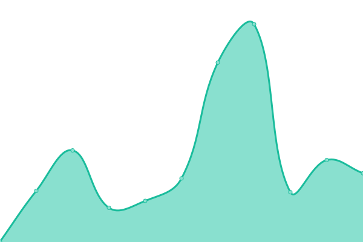

# [📈 Live Status](https://status.thombruce.com): <!--live status--> **🟩 All systems operational**

This repository contains the open-source uptime monitor and status page for [Thom Bruce](https://thombruce.com/), powered by [Upptime](https://github.com/upptime/upptime).

With [Upptime](https://upptime.js.org), you can get your own unlimited and free uptime monitor and status page, powered entirely by a GitHub repository. We use [Issues](https://github.com/thombruce/status/issues) as incident reports, [Actions](https://github.com/thombruce/status/actions) as uptime monitors, and [Pages](https://status.thombruce.com) for the status page.

<!--start: status pages-->
<!-- This summary is generated by Upptime (https://github.com/upptime/upptime) -->
<!-- Do not edit this manually, your changes will be overwritten -->
<!-- prettier-ignore -->
| URL | Status | History | Response Time | Uptime |
| --- | ------ | ------- | ------------- | ------ |
|  [ThomBruce.com](https://thombruce.com) | 🟩 Up | [thom-bruce-com.yml](https://github.com/thombruce/status/commits/HEAD/history/thom-bruce-com.yml) | 

 155ms
     
 | 

<a href="https://status.thombruce.com/history/thom-bruce-com">100.00%</a>
    

|  [Undefined](https://code.thombruce.com) | 🟩 Up | [undefined.yml](https://github.com/thombruce/status/commits/HEAD/history/undefined.yml) | 

 296ms
     
 | 

<a href="https://status.thombruce.com/history/undefined">99.78%</a>
    

|  [Popcorn](https://popcorn.thombruce.com) | 🟩 Up | [popcorn.yml](https://github.com/thombruce/status/commits/HEAD/history/popcorn.yml) | 

 305ms
     
 | 

<a href="https://status.thombruce.com/history/popcorn">100.00%</a>
    

|  [Happy](https://happy.thombruce.com) | 🟩 Up | [happy.yml](https://github.com/thombruce/status/commits/HEAD/history/happy.yml) | 

 182ms
     
 | 

<a href="https://status.thombruce.com/history/happy">100.00%</a>
    

<!--end: status pages-->

[**Visit our status website →**](https://status.thombruce.com)

## 📄 License

- Powered by: [Upptime](https://github.com/upptime/upptime)
- Code: [MIT](./LICENSE) © [Thom Bruce](https://thombruce.com/)
- Data in the `./history` directory: [Open Database License](https://opendatacommons.org/licenses/odbl/1-0/)
