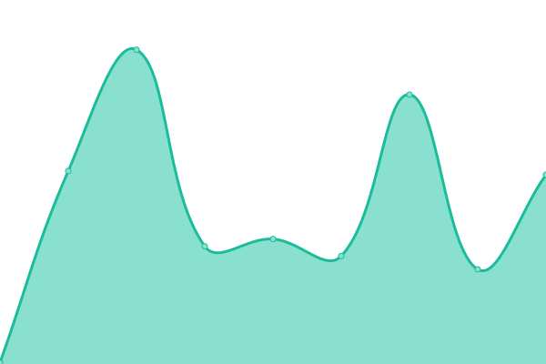

# [📈 Live Status](https://status.thombruce.com): <!--live status--> **🟩 All systems operational**

This repository contains the open-source uptime monitor and status page for [Thom Bruce](https://thombruce.com/), powered by [Upptime](https://github.com/upptime/upptime).

With [Upptime](https://upptime.js.org), you can get your own unlimited and free uptime monitor and status page, powered entirely by a GitHub repository. We use [Issues](https://github.com/thombruce/status/issues) as incident reports, [Actions](https://github.com/thombruce/status/actions) as uptime monitors, and [Pages](https://status.thombruce.com) for the status page.

<!--start: status pages-->
<!-- This summary is generated by Upptime (https://github.com/upptime/upptime) -->
<!-- Do not edit this manually, your changes will be overwritten -->
<!-- prettier-ignore -->
| URL | Status | History | Response Time | Uptime |
| --- | ------ | ------- | ------------- | ------ |
|  [ThomBruce.com](https://thombruce.com) | 🟩 Up | [thom-bruce-com.yml](https://github.com/thombruce/status/commits/HEAD/history/thom-bruce-com.yml) | 

 137ms
     
 | 

<a href="https://status.thombruce.com/history/thom-bruce-com">100.00%</a>
    

|  [The Definitive Edition](https://thedefinitiveedition.thombruce.com) | 🟩 Up | [the-definitive-edition.yml](https://github.com/thombruce/status/commits/HEAD/history/the-definitive-edition.yml) | 

 4110ms
     
 | 

<a href="https://status.thombruce.com/history/the-definitive-edition">100.00%</a>
    

|  [Free as in Beer](https://freeasinbeer.thombruce.com) | 🟩 Up | [free-as-in-beer.yml](https://github.com/thombruce/status/commits/HEAD/history/free-as-in-beer.yml) | 

 0ms
     
 | 

<a href="https://status.thombruce.com/history/free-as-in-beer">100.00%</a>
    

|  [TNT](https://tnt.thombruce.com) | 🟩 Up | [tnt.yml](https://github.com/thombruce/status/commits/HEAD/history/tnt.yml) | 

 127ms
     
 | 

<a href="https://status.thombruce.com/history/tnt">100.00%</a>
    

|  [Toodles](https://toodles.netlify.app) | 🟩 Up | [toodles.yml](https://github.com/thombruce/status/commits/HEAD/history/toodles.yml) | 

 223ms
     
 | 

<a href="https://status.thombruce.com/history/toodles">100.00%</a>
    

|  [Umami](https://umami.thombruce.com) | 🟩 Up | [umami.yml](https://github.com/thombruce/status/commits/HEAD/history/umami.yml) | 

 201ms
     
 | 

<a href="https://status.thombruce.com/history/umami">100.00%</a>
    

|  [Cusdis](https://cusdis.thombruce.com) | 🟩 Up | [cusdis.yml](https://github.com/thombruce/status/commits/HEAD/history/cusdis.yml) | 

 7359ms
     
 | 

<a href="https://status.thombruce.com/history/cusdis">100.00%</a>
    

<!--end: status pages-->

[**Visit our status website →**](https://status.thombruce.com)

## 📄 License

- Powered by: [Upptime](https://github.com/upptime/upptime)
- Code: [MIT](./LICENSE) © [Thom Bruce](https://thombruce.com/)
- Data in the `./history` directory: [Open Database License](https://opendatacommons.org/licenses/odbl/1-0/)
